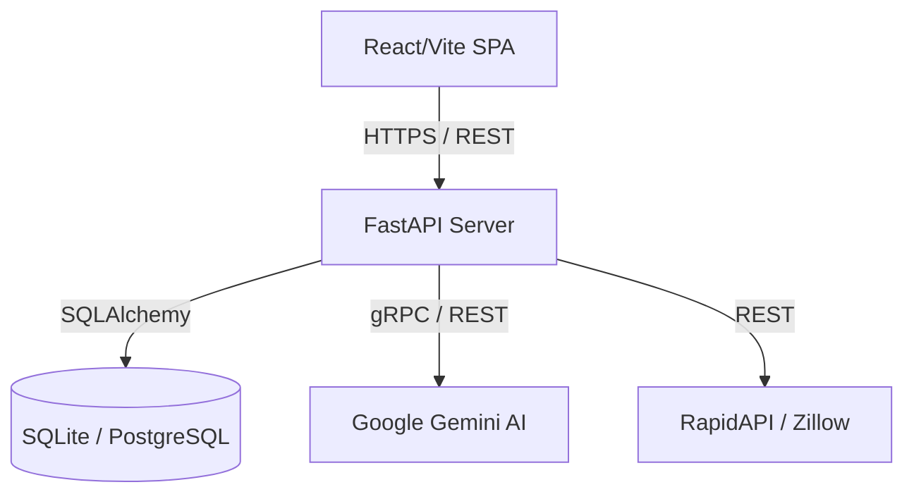

# System Architecture & Design Guide

This document outlines the architectural decisions, structural layout, database schema, and interface contracts for the Elara application. 

## 1. System Overview

Elara is structured as a decoupled full-stack web application. The frontend is a Single Page Application (SPA) built with React and Vite, while the backend is a RESTful API powered by FastAPI. Both layers communicate over HTTP with JSON payloads, secured by local JSON Web Tokens (JWT).



## 2. Codebase Layout

The repository is organized into distinct domain boundaries:

### `backend/` (FastAPI)
The backend enforces business logic, data persistence, and external service integrations.
- **`main.py`**: The API router and dependency injector. Contains endpoints for CRUD operations and financial reporting metrics (Cash Flow, Schedule E).
- **`auth.py`**: Handles local HS256 JWT creation, validation, and password hashing (bcrypt).
- **`models.py`**: Defines the database schema using SQLAlchemy ORM (Users, Properties, Tenants, Transactions, Documents).
- **`database.py`**: Manages the database engine and session contexts.
- **`agent.py`**: Encapsulates all Google Gemini AI logic for generating portfolio insights, drafting letters, and extracting data from receipts.
- **`seed.py`**: A utility script to populate the database with realistic, multi-month demonstration data.

### `frontend/` (React SPA)
The frontend manages state, view routing, and the presentation layer.
- **`src/App.tsx`**: Core routing tree handling public landing pages and authenticated dashboard views.
- **`src/auth.ts`**: Frontend authentication utilities, including token storage and a custom `authFetch` wrapper that automatically injects the Bearer token.
- **`src/components/`**: Feature-specific view components (e.g., `Dashboard.tsx`, `Tools.tsx`, `Calendar.tsx`).
- **`src/index.css`**: The core design system implementing Vanilla CSS with a global Glassmorphism aesthetic.

## 3. Interface Contracts

### Authentication Flow (Local JWT)
Elara uses local authentication, completely eliminating reliance on third-party identity providers for core access.
- **Login Request**: Client sends `POST /api/login` with email and password.
- **Token Generation**: Backend verifies credentials and issues an HS256 JWT signed with `RE_PORTFOLIO_JWT_SECRET`.
- **Authorization**: The frontend's `authFetch` appends `Authorization: Bearer <token>` to all subsequent protected route requests.
- **Validation**: If a token is expired or invalid, the backend returns `401 Unauthorized`, and the frontend redirects the user to the login view.

### AI Integration (Google Gemini)
- Backend calls Google's `google-generativeai` SDK securely.
- If the `GOOGLE_API_KEY` is missing or the service is unreachable, the backend is designed to degrade gracefully, returning structured fallback JSON to the frontend so the UI doesn't crash.

### Dashboard & Market Data Endpoints
The dashboard consumes a highly aggregated payload combining local operational data with live Zillow averages.

```json
// GET /api/dashboard Response Format
{
  "metrics": {
    "totalPortfolioValue": 1250000,
    "monthlyRevenue": 8500,
    "avgRoi": 12.4,
    "occupancyRate": 95
  },
  "chartData": [
    { "month": "Jan", "revenue": 8500, "expenses": 2100 }
  ],
  "alerts": [
    { "id": 1, "type": "warning", "title": "Maintenance", "description": "HVAC predictive alert." }
  ],
  "marketData": {
    "cityAveragePrice": 450000,
    "cityAverageRent": 2800,
    "listings": [...]
  }
}
```

## 4. Design System & Theming

The frontend leverages a modern, lightweight Vanilla CSS approach utilizing CSS Custom Properties (Variables) to ensure consistent spacing, typography, and colors.
- **Typography**: EB Garamond (Headings for a premium, authoritative feel) and Inter (Body for readability).
- **Theme**: Light theme base with deep, sophisticated accent gradients.
- **Components**: Heavy use of "Glassmorphism" — `.glass-panel` utilizes backdrop-blur and subtle borders to create a layered, desktop-like spatial environment within the browser.

## 5. Security & Data Protection
- **Secrets Management**: All secrets (`JWT_SECRET`, `GOOGLE_API_KEY`) are kept exclusively on the backend, injected via environment variables. The frontend never possesses API keys.
- **SQL Injection**: Prevented globally via SQLAlchemy's parameterized query engine.
- **Cross-Origin Resource Sharing (CORS)**: Configured strictly in `main.py` to only allow the designated Vite frontend URLs.